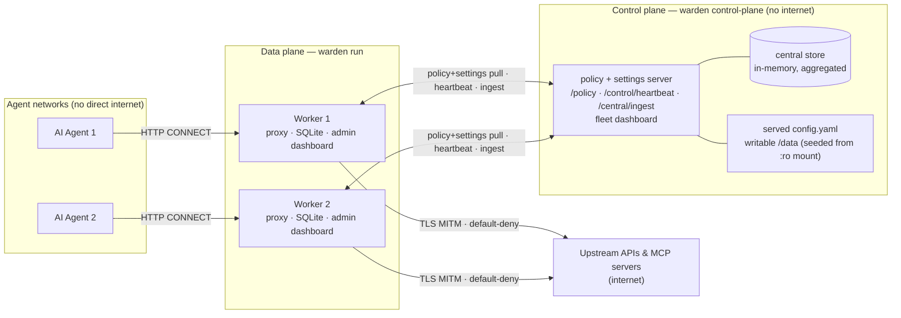
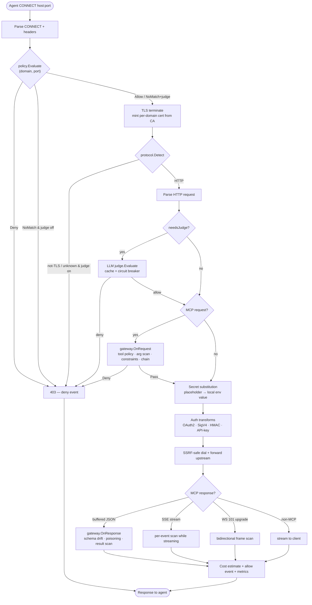
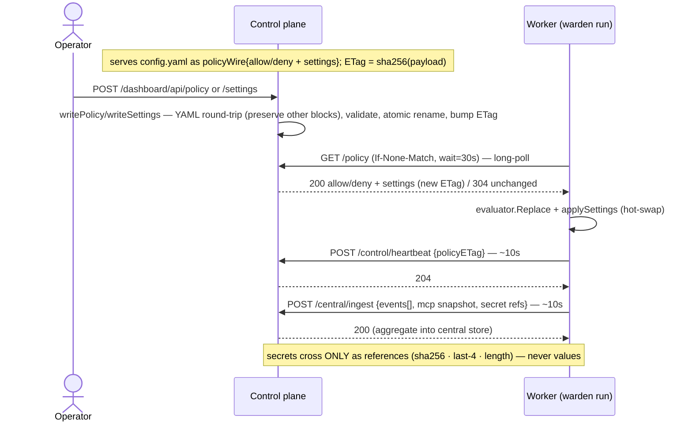

# Warden Architecture

Warden is a **default-deny egress guardrail proxy** for AI agents. An agent's outbound
traffic is pointed at Warden (via `HTTP CONNECT`); Warden terminates TLS, decides
**allow / deny** per destination, optionally consults an LLM judge for unmatched
destinations, inspects MCP tool traffic, injects secrets by reference, and records a
per-request analytics event — never forwarding a request that matched no rule and no
judge.

One `warden` binary runs in two roles (same code, different subcommand):

| Role | Command | Responsibility |
|---|---|---|
| **Data plane (worker)** | `warden run` | The interception proxy on the request hot path. |
| **Control plane** | `warden control-plane` | Serves allow/deny **policy** + behavioral **settings** to workers, aggregates fleet analytics, hosts the fleet dashboard. |
| Offline (CLI) | `warden advise` | Reads recorded events and prints suggested policy — never mutates config. |

Three core interfaces isolate every external dependency (`test/fakes/` provides doubles):
`ConfigProvider` (policy source), `SecretProvider` (secret resolution), `AnalyticsStore`
(event storage). Nothing on the hot path reaches around them.

---

## 1. System context & deployment topology

Workers sit inline between agents and the internet. The control plane is reachable by
workers but has **no internet egress**; agents can reach **only** their worker. Secrets
live on the worker (resolved from local env) and never cross to the control plane.

**Isolation (docker-compose):** `cp-net` connects workers to the control plane; `egress`
gives workers (only) internet; per-worker `wN-internal` networks keep each agent reachable
only by its worker. **TLS/CA:** a proxy CA (generated once) mints the control-plane server
cert and every per-domain MITM cert; workers trust the control plane via `controlPlane.caCert`.

---

## 2. Data-plane request pipeline

Every request runs the same ordered gate chain. The first failing gate denies with a
`403` and records one deny event; a fully-allowed request records one allow event with
judge/tool/secret/cost detail. Live components (MCP gateway, judge, secrets, analytics)
are read once per request through atomic pointers, so a control-plane hot-swap never
changes a request mid-flight.

**Decision semantics.** `policy.Evaluate` returns `Allow` (allowlist), `Deny` (denylist,
wins) or `NoMatch`. `NoMatch` is denied unless the judge is enabled, in which case the
request is terminated and the judge decides (fail-closed on any judge error). Judge is
consulted **only** for `NoMatch` — allowlisted traffic never pays for it. Non-HTTP or
non-TLS traffic under judge is denied; statically-allowed opaque traffic is raw-tunnelled.

---

## 3. Control plane & config plane

Exactly **three** worker→control-plane interactions. Everything the control plane manages
rides the existing policy long-poll — no extra worker→CP channel.

**Config plane hot-apply.** Distributed `settings` carry only non-secret config and
**env-name** references (e.g. `judge.apiKeyEnv`), never secret values — the wire type has
no value field, so this is structural. The worker applies each block on the poll:

| Setting | Apply | Mechanism |
|---|---|---|
| allow / deny policy | live | `evaluator.Replace` |
| MCP gateway | live | rebuild gateway, swap `atomic.Pointer` |
| judge + agents | live | rebuild judge (API key from local env), swap `atomic.Pointer` |
| logging level | live | `slog.LevelVar.Set` |
| compliance tagging | live | rebuild tagging store layer, swap `atomic.Pointer` |
| secret cache TTL | live | rebuild cache, swap `atomic.Pointer` |
| logging format | restart | handler type is fixed at construction |
| observability (OTel) | restart | providers init once; managed worker boots OTel from distributed settings |

**Storage.** Each worker writes events to a local pure-Go SQLite store (`modernc.org/sqlite`;
references + metadata only — no secret values, no bodies) and a sync worker batches them to
`/central/ingest`. The control plane keeps an in-memory, newest-first aggregate keyed by
`proxyID` for the fleet dashboard. **Dashboard**: the same page splits into an **Analytics**
view (read-only traffic/blocked/secrets/MCP/cost/compliance) and a **Config** view
(fleet-mutating editors — Policy, MCP, Judge, Runtime[logging/compliance/cache],
Observability). The Config editors are editable only on the control plane (a writer is set);
on workers they render read-only.

---

## 4. Component & package map

24 `internal/` packages plus thin `cmd/proxy` wiring. Dotted lines mark the three core
interface implementations.

```mermaid
flowchart TB
  subgraph cmdp["cmd/proxy — thin wiring, no business logic"]
    root["root.go"]
    runc["run.go (worker)"]
    cpc["controlplane.go"]
    adv["advise.go"]
    root --> runc
    root --> cpc
    root --> adv
  end

  subgraph ifaces["Core interfaces — test/fakes doubles"]
    CfgI["ConfigProvider"]
    SecI["SecretProvider"]
    AnI["AnalyticsStore"]
  end

  subgraph dplane["Data plane"]
    proxy["proxy — accept · TLS MITM · HTTP · WS · SSRF-safe dial"]
    protocol["protocol — detect + IsMCP"]
    policy["policy — default-deny evaluator"]
    agentid["agentid — identity"]
    auth["auth — request transforms"]
    secrets["secrets — cache + env fetch"]
    scan["scan — injection · leak · PII"]
  end

  subgraph mcpw["MCP wedge"]
    gw["mcp/gateway — OnRequest/OnResponse"]
    mcpc["mcp — parse · tool policy · schema · chain · profiler"]
    sseP["mcp/sse"]
    stdioP["mcp/stdio"]
    wsP["mcp/ws"]
  end

  subgraph jgrp["LLM judge"]
    llmpolicy["llmpolicy — Judge (cache · breaker)"]
    llm["llm — OpenAI-compatible client"]
  end

  subgraph cplane["Control plane"]
    cp["controlplane — server · registry · long-poll"]
    config["config — local YAML · RemoteProvider · SettingsWire"]
    dashboard["dashboard — Analytics | Config UI + APIs"]
    admin["admin — /healthz · refresh-secrets"]
  end

  subgraph store["Storage & telemetry"]
    analytics["analytics — SQLite · central · sync"]
    audit["audit — compliance tagging · signed receipts"]
    observability["observability — slog · OTel"]
    cost["cost — spend estimate"]
  end

  subgraph off["Offline (CLI)"]
    policybuilder["policybuilder — suggest policy from traffic"]
    policyeval["policyeval — replay + diff candidate policy"]
  end

  runc --> proxy
  cpc --> cp
  proxy --> policy
  proxy --> protocol
  proxy --> agentid
  proxy --> auth
  proxy --> scan
  proxy --> gw
  proxy --> llmpolicy
  proxy --> secrets
  proxy --> analytics
  proxy --> cost
  proxy --> observability
  gw --> mcpc
  gw --> scan
  gw --> sseP
  gw --> stdioP
  gw --> wsP
  llmpolicy --> llm
  cp --> config
  cp --> dashboard
  cp --> analytics
  cp --> admin
  analytics --> audit
  config -.implements.-> CfgI
  secrets -.implements.-> SecI
  analytics -.implements.-> AnI
```

---

## 5. Runtime hot-swap (worker)

The long-lived `Proxy` holds swappable dependencies behind `atomic.Pointer`s so the
control-plane apply loop can replace them with zero request tearing. Each request loads a
snapshot once; a concurrent `Set*` only affects subsequent requests.

| Field | Reader | Setter | Disabled state |
|---|---|---|---|
| `mcp atomic.Pointer[gateway.Gateway]` | `p.mcpGateway()` | `SetMCPGateway` | nil pointer |
| `judgeP atomic.Pointer[judgeHolder]` | `p.judge()` | `SetJudge` | nil holder / nil judge |
| `secretsP atomic.Pointer[secretsHolder]` | `p.secrets()` | `SetSecrets` | always set |
| `analyticsP atomic.Pointer[analyticsHolder]` | `p.analyticsStore()` | `SetAnalytics` | always set |

The policy evaluator swaps internally (`evaluator.Replace` under an RWMutex); logging level
swaps via a shared `slog.LevelVar`.

---

## Key invariants

- **Default-deny is sacred.** A destination on neither list is denied unless the judge
  is enabled; non-HTTP/non-TLS traffic under judge is denied.
- **Secrets never cross the control-plane boundary** — distributed config references
  secrets by env name only; forwarded analytics carry references (hash · last-4 · length),
  never values. Secret values are resolved from the worker's own environment.
- **Logging hygiene:** references not raw secrets; headers/metadata, never full bodies.
- **Three worker→CP interactions only:** long-poll policy+settings pull, heartbeat,
  analytics ingest. The control plane never calls into a worker.
- **SSRF protection:** upstream dials reject private IP ranges.
- **Single static binary:** pure-Go SQLite (no CGo); one binary, two roles.
